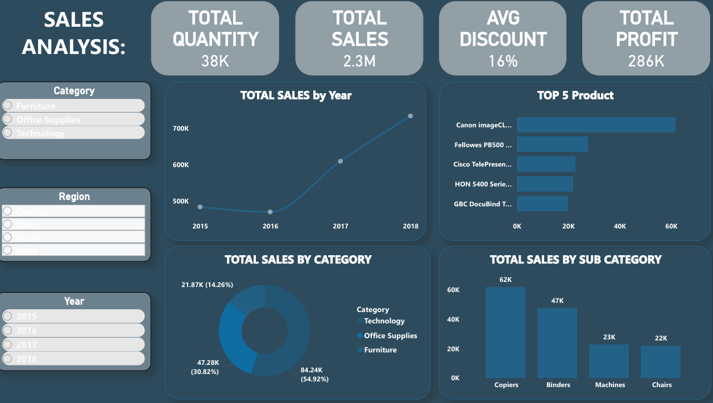

# 📊 Sales Analysis Dashboard - Power BI

## 📌 Project Overview
This dashboard provides a comprehensive sales performance analysis for a **retail business**, tracking revenue, profit, quantity, discounts, and customer metrics across multiple dimensions. Built using **Power BI** with **Power Query** for data transformation and **Figma** for prototyping, the dashboard enables stakeholders to monitor sales trends, identify top-performing products and regions, and make data-driven strategic decisions.

## 🖥️ Dashboard Preview

## 🎯 Objectives
- Monitor total sales, profit, quantity, cost, and average discount.
- Analyze sales trends over time (2015–2018).
- Identify top-performing categories, sub-categories, regions, and products.
- Track customer distribution across regions.
- Provide actionable insights to optimize product mix, inventory, and regional strategies.

## 🛠️ Tools Used
- **Power BI** – Dashboard design and interactive visualizations
- **Power Query** – Data extraction, cleaning, and transformation
- **DAX** – Custom measures for KPIs and calculations
- **Figma** – Wireframing and dashboard prototype design

## 💡 Key Insights
- **Total Sales** reached **$2.3M**, with a total profit of **$286K** and total cost of **$2M**.
- The average discount across all transactions is **16%**.
- **2018** was the top-performing year, showing consistent sales growth from 2015 to 2018.
- The **West** region leads in sales, quantity, profit, and customer count, making it the strongest market.
- **Technology** is the top category (**$836K**), followed by **Furniture** (**$742K**) and **Office Supplies** (**$719K**).
- **Copiers** is the top sub-category, followed by **Binders**, **Machines**, and **Chairs**.
- **Zipper Ring Binder Pockets** is the top-selling product, with **Canon imageCLASS**, **Fellowes PB500**, and **Cisco TelePresence** also in the top 5.
- **Wilmington** is the top-performing city.
- The **Corporate** segment leads in quantity sold, followed by **Home Office** and **Consumer**.

## 📋 Dashboard Features

### Key Performance Indicators (KPIs)
- **Total Sales** – Overall revenue generated
- **Total Profit** – Net earnings
- **Total Quantity** – Units sold
- **Total Cost** – Cost of goods sold
- **Avg Discount** – Average discount percentage

### Filters & Interactivity
- **Category** – Furniture, Office Supplies, Technology
- **Sub-Category** – Drill-down to specific product types
- **Region** – Central, East, South, West
- **Year** – 2015–2018

### Visualizations
- **Cards** – KPI summaries at the top
- **Line chart** – Sales trends by year (2015–2018)
- **Bar charts** – Sales by category, sub-category, and region
- **Pie charts** – Sales distribution by category
- **Map** – Regional sales distribution
- **Treemap** – Customer distribution by region
- **Horizontal bar charts** – Top 5 products and top customers
- **Slicers** – Interactive filters for dynamic exploration
